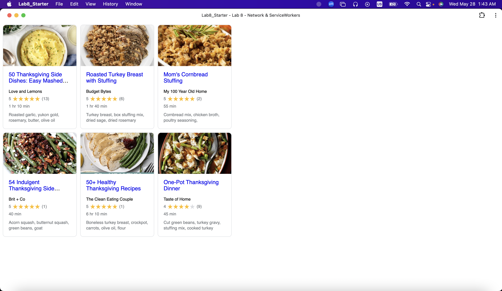

# Lab8-Starter

## Collaborators

Brandon Khor

## GitHub Pages URL

[URL to pages](https://brandonkhor.github.io/Lab8_Starter/)

## How are graceful degradation and service workers related?

Graceful degradation is the concept of starting with maximum technology and then addressing lower levels (HTML/CSS), which works great for applications, where functionality is the most significant part. Service Workers aim to manage caches to prevent complete loss of functionality when there is no network connection. They are similar because both of them are in place where even when certain technologies/features are unavailable (HTML/CSS for Graceful Degradation and network for Service Workers), the app can still function.

## Screenshot

